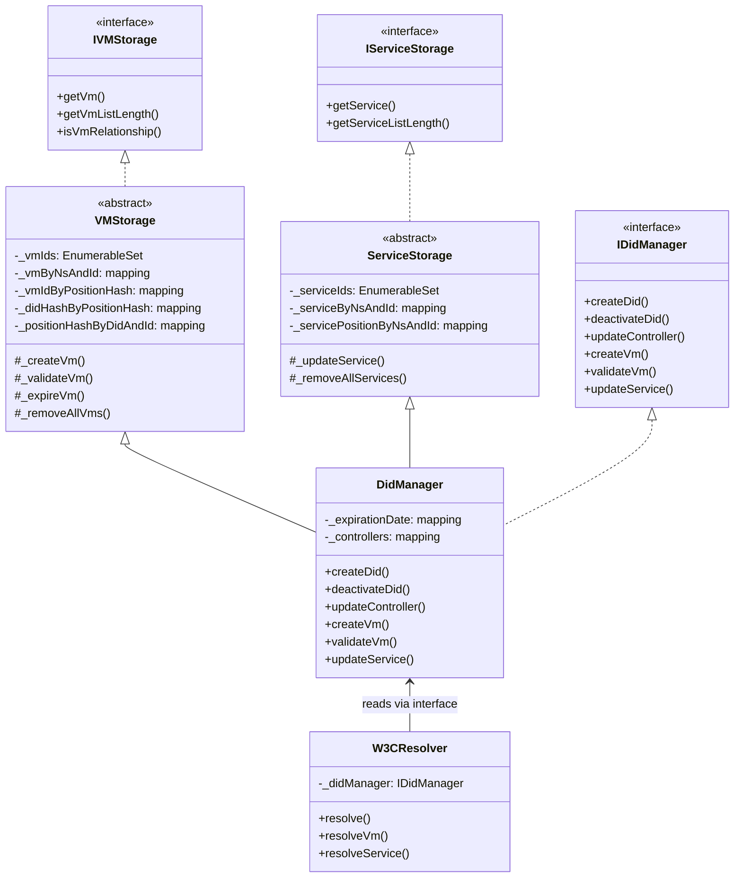
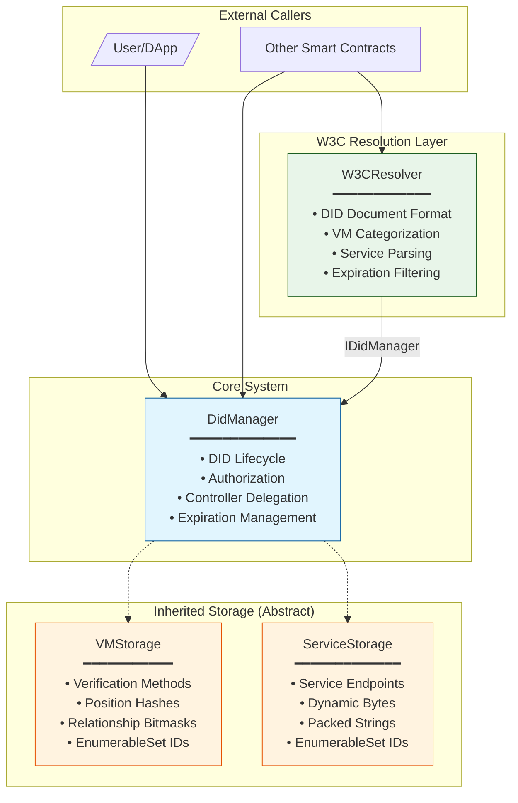
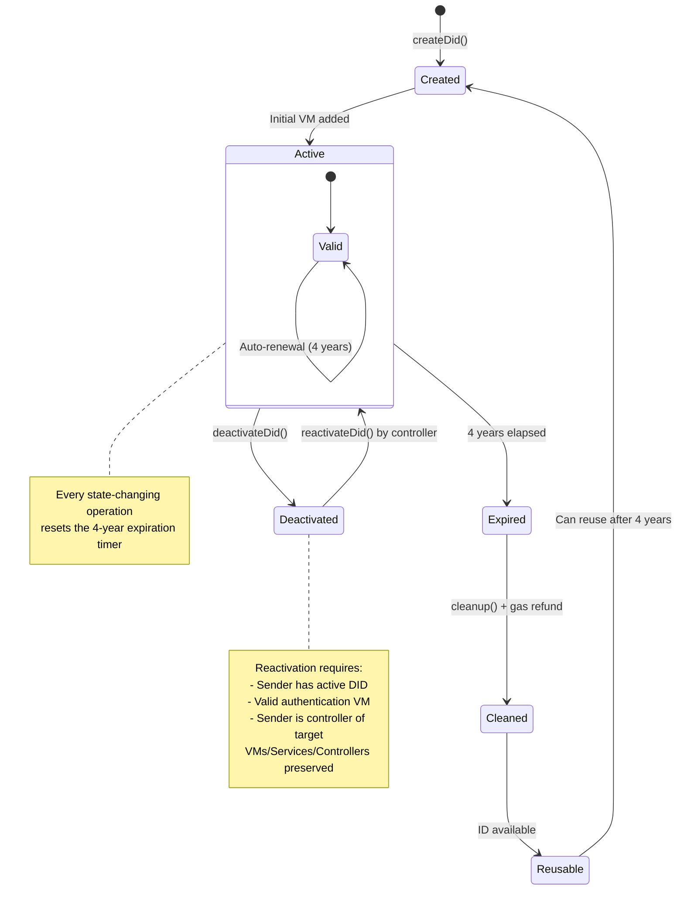
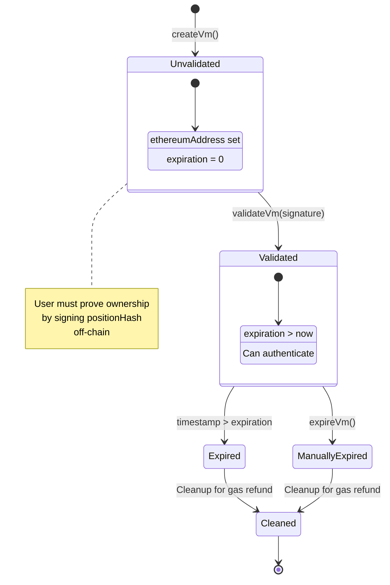
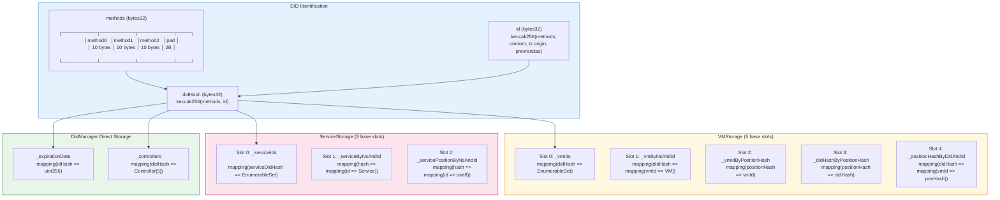
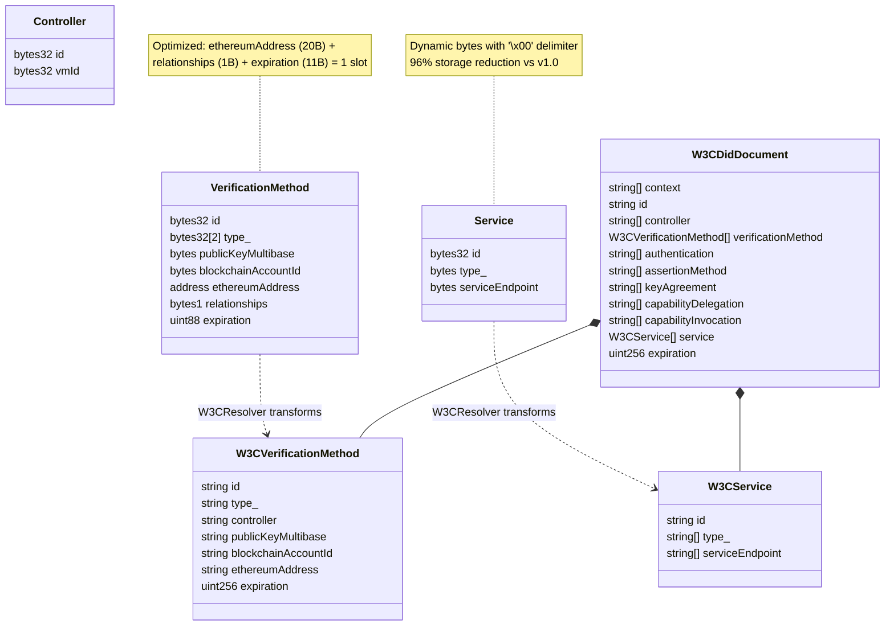
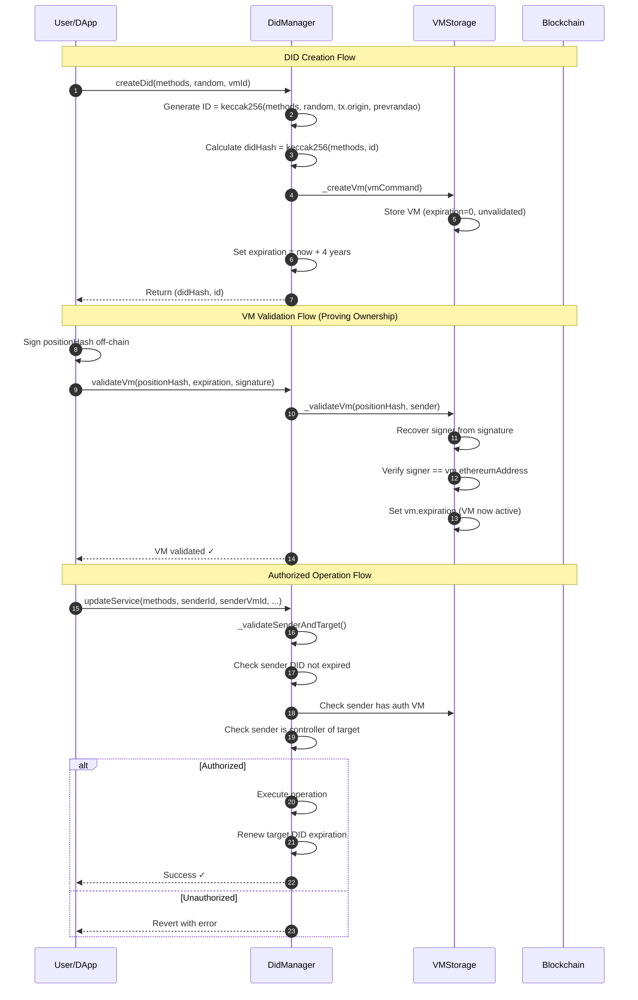
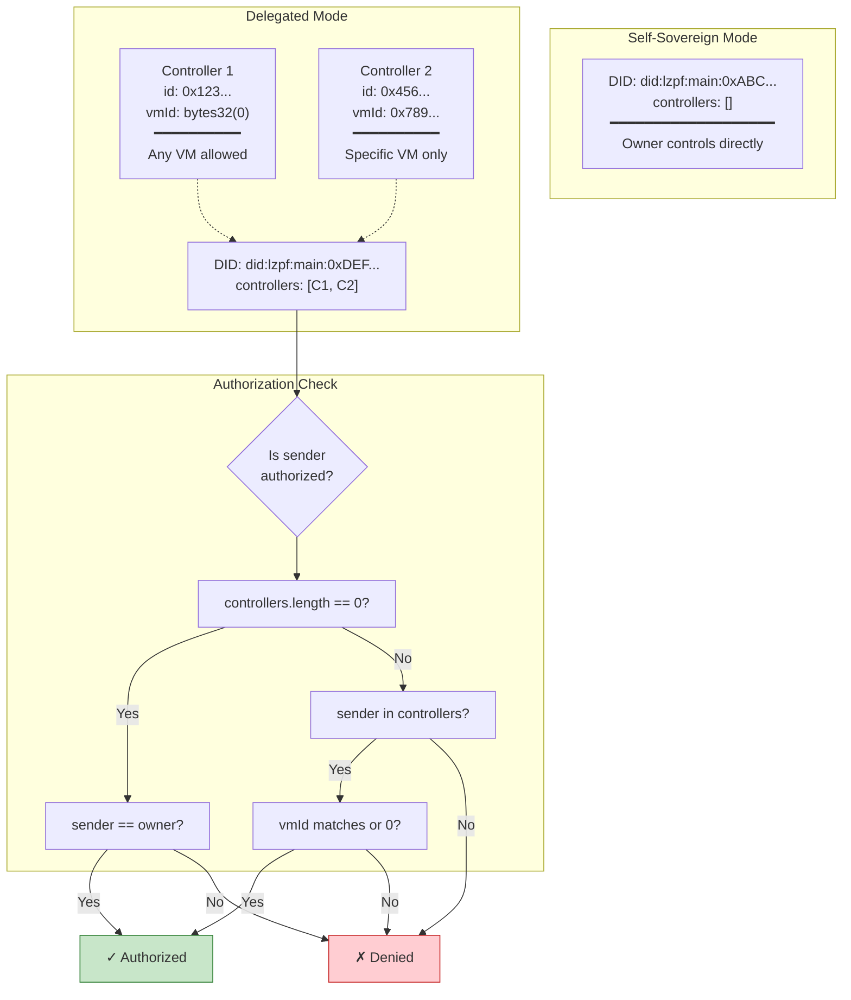
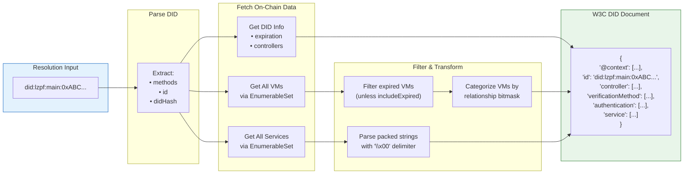

# PROJECT.md - SSIoBC-did Project Knowledge Base

This file is the **single source of truth** for project domain knowledge, referenced by CLAUDE.md, AGENTS.md, and GEMINI.md.

## Table of Contents

- [Project Overview](#project-overview)
- [Academic Context & Innovation](#academic-context--innovation)
- [Architecture Diagrams](#architecture-diagrams)
- [Smart Contract Architecture](#smart-contract-architecture)
- [DID Structure & Concepts](#did-structure--concepts)
- [Key Design Patterns](#key-design-patterns)
- [Key Technologies](#key-technologies)
- [File Organization](#file-organization)

## Project Overview

**SSIoBC-did** is a research implementation of a fully on-chain Decentralized Identifier (DID) management system that maintains W3C compliance while enabling smart contract interoperability.

### Key Features

- **Full on-chain storage** (unlike ERC-1056 event-based approach)
- **Gas-optimized** hash-based list architecture using EnumerableSet
- **Multi-method support** (3-level deep DID methods: `did:method0:method1:method2:id`)
- **4-year expiration** with reuse capability
- **W3C DID specification compliance**
- **Smart contract interoperability** (direct on-chain resolution)

### Core Technologies

- **Solidity**: 0.8.33 (fixed version for deterministic builds)
- **EVM**: Osaka (Fusaka hardfork)
- **Framework**: Foundry (Forge, Cast, Anvil)
- **Testing**: Forge test framework with >90% coverage requirement
- **Libraries**: OpenZeppelin (EnumerableSet, Ownable, Strings)
- **Network**: Ethereum (EVM-compatible chains)

## Academic Context & Innovation

### Research Goal

This is a **PhD research project** demonstrating that complete DID document storage on-chain is feasible while maintaining:

- W3C DID Core specification compliance
- Gas-efficient operations
- Smart contract interoperability
- Self-sovereign identity principles

### Innovation Claim

**First fully on-chain DID document management system** that:

1. Stores complete DID documents on-chain (vs event-based reconstruction)
2. Maintains W3C compliance (vs non-standard approaches)
3. Enables direct smart contract interoperability
4. Achieves gas efficiency through hash-based list architecture

### Comparison with Existing Solutions

| System | Approach | Storage | W3C Compliance | Smart Contract Interop |
|--------|----------|---------|----------------|------------------------|
| **SSIoBC-did** | Full on-chain documents | On-chain | ✅ Yes | ✅ Direct |
| **ERC-1056** | Event-based reconstruction | Events | ⚠️ Partial | ❌ Off-chain required |
| **EBSI** | Privacy-first, mediated | Off-chain | ✅ Yes | ⚠️ Limited |
| **LACChain** | Enhanced governance | Hybrid | ✅ Yes | ⚠️ Bureaucratic |
| **uPort/ONCHAINID** | Pre-W3C standards | Hybrid | ❌ Pre-standard | ⚠️ Limited |

## Architecture Diagrams

This section provides visual representations of the SSIoBC-did system architecture.

### Contract Inheritance Hierarchy



### System Component Overview



### DID Lifecycle State Machine



### Verification Method Lifecycle



### Storage Architecture



### Data Structures



### Authentication & Authorization Flow



### Controller Delegation Model



### W3C Resolution Data Flow



### Gas Optimization Strategies

```mermaid
mindmap
    root((Gas
    Optimization))
        Storage
            Hash-Based Indexing
                O(1) lookups
                vs O(n) arrays
            EnumerableSet
                Efficient add/remove
                O(1) contains
            Slot Packing
                address + bytes1 + uint88
                = 1 slot (32 bytes)
            Dynamic Bytes
                Service: 96% reduction
                VM: flexible key sizes
        Code
            Custom Errors
                50-100 gas savings
                vs require strings
            Unchecked Arithmetic
                When overflow impossible
                Saves bounds checks
            Storage Caching
                Single SLOAD
                Memory operations
        Architecture
            No Proxies
                Direct calls
                No delegate overhead
            Abstract Contracts
                Code reuse
                Modular storage
            Immutable Design
                No upgrade checks
                Predictable gas
```

## Smart Contract Architecture

### Four-Contract System

The system consists of four main contracts working together:

#### 1. DidManager.sol

**Purpose**: Core DID lifecycle management

**Responsibilities**:
- DID creation with unique ID generation
- DID deactivation (W3C compliant)
- Ownership management
- Controller delegation
- Expiration handling

**Inheritance**: Inherits from VMStorage and ServiceStorage

**Key Functions**:
- `createDid(bytes32 methods, bytes32 random, bytes32 vmId)` - Create new DID
- `deactivateDid(bytes32 didHash)` - W3C-compliant deactivation
- `updateDidOwner(bytes32 didHash, address newOwner)` - Transfer ownership
- `updateDidControllers(bytes32 didHash, Controller[] memory newControllers)` - Manage delegation

#### 2. VMStorage.sol

**Purpose**: Verification Methods storage with hash-based lists

**Type**: Abstract contract (inherited by DidManager)

**Responsibilities**:
- Add/remove/update verification methods
- Relationship type management (authentication, assertion, key agreement, etc.)
- Expiration tracking for VMs
- Ethereum address validation

**Storage Architecture (v1.0):**

```
┌─────────────────────────────────────────────────────────────────────────┐
│                      VMStorage State Variables                           │
├─────────────────────────────────────────────────────────────────────────┤
│                                                                          │
│  Slot 0: _vmIds                                                         │
│  mapping(bytes32 didHash => EnumerableSet.Bytes32Set vmIds)             │
│  Purpose: O(1) add/remove/contains operations for VM IDs                │
│                                                                          │
│  Slot 1: _vmByNsAndId                                                   │
│  mapping(bytes32 didHash => mapping(bytes32 vmId => VerificationMethod))│
│  Purpose: Main VM data storage                                          │
│                                                                          │
│  Slot 2: _vmIdByPositionHash                                            │
│  mapping(bytes32 positionHash => bytes32 vmId)                          │
│  Purpose: Position-based VM lookup for validation                       │
│                                                                          │
│  Slot 3: _didHashByPositionHash                                         │
│  mapping(bytes32 positionHash => bytes32 didHash)                       │
│  Purpose: Locate DID from position hash                                 │
│                                                                          │
│  Slot 4: _positionHashByDidAndId                                        │
│  mapping(bytes32 didHash => mapping(bytes32 vmId => bytes32 posHash))   │
│  Purpose: Reverse lookup for cleanup                                    │
│                                                                          │
└─────────────────────────────────────────────────────────────────────────┘
Total Base Slots: 5 (reduced from 28 in v0.8.0)
```

**Verification Method Storage (per VM):**
- Dynamic bytes for keys: Uses only needed storage vs fixed 512-byte arrays
- Slot packing: `ethereumAddress` + `relationships` + `expiration` in single slot
- Supports RSA-4096 and post-quantum keys (up to 1024 bytes)

**Key Types Supported:**
- `publicKeyMultibase` (pre-encoded multibase string, e.g., "zQ3shok...")
- `blockchainAccountId` (CAIP-10 format string)
- `ethereumAddress` (native Ethereum address)

#### 3. ServiceStorage.sol

**Purpose**: Service endpoints storage with dynamic bytes (optimized in v1.0.1)

**Type**: Abstract contract (inherited by DidManager)

**Responsibilities**:
- Add/remove/update service endpoints
- Service type management
- Service endpoint URL storage

**Storage Architecture (v1.0.1 - Optimized):**

```
┌─────────────────────────────────────────────────────────────────────────┐
│                    ServiceStorage State Variables                        │
├─────────────────────────────────────────────────────────────────────────┤
│                                                                          │
│  Slot 0: _serviceIds                                                    │
│  mapping(bytes32 serviceDidHash => EnumerableSet.Bytes32Set ids)        │
│  Purpose: O(1) add/remove/contains for service IDs                      │
│                                                                          │
│  Slot 1: _serviceByNsAndId                                              │
│  mapping(bytes32 => mapping(bytes32 => Service))                        │
│  Purpose: Main Service data storage                                      │
│                                                                          │
│  Slot 2: _servicePositionByNsAndId                                      │
│  mapping(bytes32 => mapping(bytes32 => uint8))                          │
│  Purpose: Position tracking for events                                   │
│                                                                          │
└─────────────────────────────────────────────────────────────────────────┘
```

**Service Struct (v1.0.1 Optimized):**
```solidity
struct Service {
  bytes32 id;           // 1 slot - service identifier
  bytes type_;          // dynamic bytes - packed types with '\x00' delimiter
  bytes serviceEndpoint; // dynamic bytes - packed URLs with '\x00' delimiter
}
```

**Storage Efficiency:**
- **Before (v1.0):** 161 slots per service (5,152 bytes) - fixed `bytes32[20][4]` arrays
- **After (v1.0.1):** ~6 slots typical (192 bytes) - dynamic bytes
- **Savings:** 96% reduction per service

**Key Optimizations:**
1. **Dynamic Bytes:** Uses only needed storage vs fixed 161-slot arrays
2. **Null Delimiter:** Types/endpoints packed with `\x00` separator
3. **Flexible Lengths:** Max 500 bytes for types, 2000 bytes for endpoints
4. **Gas Reduction:** ~90% reduction in service creation gas

#### 4. W3CResolver.sol

**Purpose**: W3C-compliant DID document translation

**Type**: Standalone contract (optional on-chain resolution)

**Responsibilities**:
- Resolve DIDs to W3C DID documents
- Format verification methods according to W3C spec
- Format service endpoints
- Return resolution metadata

**Output**: Complete W3C DID Document structure

### Key Design Patterns

#### Abstract Storage Contracts

VMStorage and ServiceStorage are **abstract contracts** inherited by DidManager:

```
DidManager.sol
    ├─ inherits VMStorage (abstract)
    └─ inherits ServiceStorage (abstract)
```

**Benefits**:
- Modular storage separation
- Cleaner code organization
- Reusable storage patterns

#### EnumerableSet Usage

Efficient O(1) operations for add/remove/contains on VM and Service IDs:

```solidity
using EnumerableSet for EnumerableSet.Bytes32Set;

EnumerableSet.Bytes32Set private _vmIds;  // O(1) operations
```

**Operations**:
- `add()` - O(1) constant time
- `remove()` - O(1) constant time
- `contains()` - O(1) constant time
- `length()` - O(1) constant time
- `at(index)` - O(1) constant time

#### Hash-Based Indexing

Uses `keccak256(abi.encodePacked(namespace, id))` for unique identification:

```solidity
bytes32 vmHash = keccak256(abi.encodePacked(didHash, vmId));
mapping(bytes32 => VerificationMethod) private _vms;
```

**Benefits**:
- Collision-resistant unique keys
- Namespace separation
- Gas-efficient lookups

#### Position-Hash Mapping

Special mapping for VM validation using position hashes:

```solidity
mapping(bytes32 => bytes32) private _vmPositionHashes;
```

Used for efficient verification of VM positions in authentication arrays.

#### Multi-level Method Support

DIDs structured as `did:method0:method1:method2:id` with 10-byte method segments:

```
bytes32 methods = [method0:10bytes][method1:10bytes][method2:10bytes][padding:2bytes]
```

**Default**: `"lzpf::main::"`

## DID Structure & Concepts

### DID Format

```
did:method0:method1:method2:id
```

**Example**:
```
did:lzpf:main:testnet:0x1234567890abcdef1234567890abcdef12345678
```

### DID Components

#### Methods (bytes32)

Contains three 10-byte method identifiers:

```
bytes32 methods = [method0][method1][method2][padding]
                  ├─10bytes─┤─10bytes─┤─10bytes─┤─2bytes─┤
```

**Default**: `"lzpf::main::"` (lzpf, empty, main, empty)

#### ID (bytes32)

Generated from:

```solidity
bytes32 id = keccak256(
    abi.encodePacked(
        methods,
        random,
        tx.origin,
        block.prevrandao
    )
);
```

**Inputs**:
- `methods` - The DID method bytes
- `random` - User-provided randomness
- `tx.origin` - Transaction originator
- `block.prevrandao` - Block randomness (post-merge)

**Uniqueness**: Cryptographically guaranteed through Keccak256

#### Hash (bytes32)

Internal hash for storage indexing:

```solidity
bytes32 didHash = keccak256(abi.encodePacked(methods, id));
```

**Purpose**: Unique identifier for storage mappings

### Verification Methods (VMs)

Verification methods enable cryptographic authentication of DID controllers.

#### Structure (v1.0 - Optimized)

```solidity
struct VerificationMethod {
    bytes32 id;                    // VM identifier (e.g., "vm-0")
    bytes32[2] type_;              // VM type (e.g., ["EcdsaSecp256k1VerificationKey20", "19"])
    bytes publicKeyMultibase;      // Pre-encoded multibase string (e.g., "zQ3shok...")
    bytes blockchainAccountId;     // CAIP-10 format string (e.g., "eip155:1:0xabc...")
    address ethereumAddress;       // Ethereum address (20 bytes) - packed
    bytes1 relationships;          // Relationship bitmask (1 byte) - packed
    uint88 expiration;             // Expiration timestamp (11 bytes) - packed
}
// Note: ethereumAddress + relationships + expiration = 32 bytes (1 slot)
```

#### Key Storage Design

**Public Key Storage:**
- `publicKeyMultibase`: Pre-encoded multibase string (must start with 'z' for base58btc)
- Callers encode the public key off-chain: `'z' + Base58(multicodec + rawPublicKey)`
- No on-chain Base58 encoding (gas optimization)

**Blockchain Account ID:**
- Stored as CAIP-10 format string directly (e.g., `"eip155:1:0xabc..."`)
- No encoding/decoding overhead

**Slot Packing:**
- `ethereumAddress` (20 bytes) + `relationships` (1 byte) + `expiration` (11 bytes) = 1 slot
- `uint88` supports timestamps up to ~9.8 million years

#### Relationship Types

VMs can be used for different purposes:

- **authentication** - Prove control of DID
- **assertionMethod** - Sign verifiable credentials
- **keyAgreement** - Establish encrypted communication
- **capabilityInvocation** - Invoke capabilities
- **capabilityDelegation** - Delegate capabilities

#### Storage

- Stored in mapping: `mapping(bytes32 didHash => mapping(bytes32 vmId => VerificationMethod))`
- Indexed by: `keccak256(abi.encodePacked(didHash, vmId))`
- Enumerated via: `EnumerableSet.Bytes32Set private _vmIds` per DID
- Position-hash mappings for validation and cleanup

#### Expiration

- VMs include `uint88` expiration timestamps (11 bytes, packed with address)
- Expired VMs are automatically filtered in resolution
- Cleanup functions available for gas reclamation

### Controller System

Controllers enable delegation of DID control to other entities.

#### Structure

```solidity
struct Controller {
    bytes32 methods;      // DID methods of controller
    bytes32 id;           // DID ID of controller
    bytes32 vmId;         // Optional: specific VM to use
}
```

#### Constraints

- **Maximum**: 5 controllers (CONTROLLERS_MAX_LENGTH = 5)
- **Self-sovereign default**: Empty controllers = owner controls
- **Delegation**: Can delegate to other DIDs with optional VM specification

#### Controller Operations

The `updateController` function supports three operations:
- **Create**: Add a new controller at a specific position (0-4)
- **Update**: Overwrite an existing controller at a given position
- **Remove**: Set `controllerId = bytes32(0)` to clear a controller at that position

```solidity
// Add controller at position 0
updateController(methods, senderId, senderVmId, targetId, controllerId, controllerVmId, 0);

// Remove controller at position 0
updateController(methods, senderId, senderVmId, targetId, bytes32(0), bytes32(0), 0);
```

#### Controller Logic

```solidity
// Empty controllers = self-sovereign (owner controls)
if (controllers.length == 0) {
    require(msg.sender == owner, "Not authorized");
}

// Non-empty = check delegation
else {
    // Verify sender is authorized via controller DID + VM
}
```

### DID Lifecycle

#### 1. Creation

```solidity
createDid(methods, random, vmId) → (didHash, id)
```

- Generate unique ID from methods + random + origin + block randomness
- Calculate didHash = keccak256(methods, id)
- Set owner = msg.sender
- Set expirationTime = block.timestamp + 4 years
- Add initial verification method
- Emit DidCreated event

#### 2. Active State

- Owner can add/remove VMs
- Owner can add/remove services
- Owner can delegate via controllers
- Owner can transfer ownership
- Automatic expiration after 4 years

#### 3. Deactivation

```solidity
deactivateDid(didHash)
```

- Set deactivated flag (W3C compliant)
- Preserve ownership (cannot be reactivated)
- DID resolution returns deactivated status
- Gas reclamation via cleanup functions

#### 4. Expiration

- Automatic after 4 years from creation
- Can be renewed before expiration
- Expired DIDs can be cleaned up for gas refund
- ID can be reused after cleanup (4-year cooldown)

## Key Design Patterns

### 1. Storage Optimization

#### Hash-Based Storage (vs Arrays)

**❌ Expensive Approach**:
```solidity
DidInfo[] private _didArray;  // O(n) operations, high gas
```

**✅ Optimized Approach**:
```solidity
mapping(bytes32 => DidInfo) private _dids;
EnumerableSet.Bytes32Set private _didSet;
```

**Benefits**:
- O(1) lookups instead of O(n) scans
- Lower gas costs for add/remove
- Efficient enumeration when needed

#### Storage Caching

**❌ Bad - Multiple SLOADs**:
```solidity
if (_dids[didHash].owner == address(0)) revert InvalidDid();
if (_dids[didHash].expirationTime < block.timestamp) revert DidExpired();
// Each access = 1 SLOAD (2100 gas cold, 100 gas warm)
```

**✅ Good - Single SLOAD**:
```solidity
DidInfo memory didInfo = _dids[didHash];  // 1 SLOAD
if (didInfo.owner == address(0)) revert InvalidDid();
if (didInfo.expirationTime < block.timestamp) revert DidExpired();
```

### 2. Immutable Architecture

- **No proxy patterns** - Direct implementation only
- **No upgradeable contracts** - Design for permanence
- **Fixed dependencies** - Pinned OpenZeppelin versions

**Rationale**: Security and predictability over upgradeability

### 3. Access Control

```solidity
modifier onlyDidOwner(bytes32 didHash) {
    if (_dids[didHash].owner != msg.sender) {
        revert NotDidOwner(msg.sender, _dids[didHash].owner);
    }
    _;
}

function updateDid(...) external onlyDidOwner(didHash) {
    // Implementation
}
```

### 4. Custom Errors (Gas Optimization)

**✅ Saves Gas**:
```solidity
error InvalidDid();
error DidExpired(uint256 expirationTime);

if (condition) revert InvalidDid();
```

**❌ Costs More**:
```solidity
require(condition, "Invalid DID");  // String storage expensive
```

**Gas Savings**: ~50-100 gas per error

## Key Technologies

### Blockchain Platform

- **Network**: Ethereum and EVM-compatible chains
- **Storage**: Full on-chain (complete DID documents)
- **Gas Optimization**: Hash-based lists, custom errors, unchecked arithmetic
- **Consensus**: Post-merge (using block.prevrandao)

### W3C Standards

- **DID Core**: v1.0 specification compliance
- **DID Methods**: Multi-level method support (`did:method0:method1:method2:id`)
- **Verification Methods**: publicKeyMultibase (pre-encoded), blockchainAccountId, ethereumAddress
- **Service Endpoints**: Standard W3C service format
- **Resolution**: On-chain W3C-compliant resolver

### Development Tools

- **Foundry**: Build, test, deploy smart contracts
- **Forge**: Solidity testing framework
- **Anvil**: Local Ethereum node for development
- **Cast**: Ethereum RPC command-line interactions

## File Organization

### Contract Structure

```
src/
├── DidManager.sol          # Core DID lifecycle management
├── VMStorage.sol           # Verification methods storage (abstract)
├── ServiceStorage.sol      # Service endpoints storage (abstract)
├── W3CResolver.sol         # W3C DID document resolution
└── interfaces/
    ├── IDidManager.sol
    ├── IVMStorage.sol
    ├── IServiceStorage.sol
    └── IW3CResolver.sol
```

### Test Structure

```
test/
├── unit/                          # Unit tests (isolated contract testing)
│   ├── DidManager.unit.t.sol
│   ├── VMStorage.unit.t.sol
│   ├── ServiceStorage.unit.t.sol
│   └── W3CResolver.unit.t.sol
├── integration/                    # Integration tests (multi-contract flows)
│   └── DidLifecycle.integration.t.sol
├── fuzz/                          # Fuzz tests (property-based testing)
│   └── DidManager.fuzz.t.sol
├── invariant/                     # Invariant tests (stateful fuzzing)
│   └── SystemInvariants.t.sol
├── performance/                   # Gas optimization tests
│   └── GasOptimization.performance.t.sol
├── stress/                        # Stress tests (boundary conditions)
│   └── StressTest.t.sol
└── helpers/
    ├── TestBase.sol               # Base test contract
    ├── DidTestHelpers.sol         # DID creation helpers
    └── Fixtures.sol               # Test data fixtures
```

### Artifact Management

#### .temp/ Folder (Temporary Files)

**Always** generate non-code related files in `.temp/` folder:

- **Examples**: Size comparisons, gas reports, analysis outputs, deployment logs, coverage reports
- **Pattern**: `.temp/analysis/`, `.temp/reports/`, `.temp/logs/` for organized sub-structure
- **Git**: Excluded from version control but preserved locally
- **Benefits**: Keeps repository clean while preserving local development artifacts

#### docs/ Folder (Permanent Documentation)

**Purpose**: Academic-quality metrics tracking and research validation

**Structure**:
- `docs/metrics/` - Performance histories (gas costs, coverage trends)
- `docs/analysis/` - Research findings and comparative analysis
- `docs/assets/` - Evidence artifacts (graphs, tables, screenshots)

**Standards**:
- Each document must have Table of Contents
- Follow consolidation over proliferation principle
- Cross-reference between documents
- Update when significant performance changes occur

#### script/ Folder (Deployment Scripts)

```
script/
├── Configuration.s.sol     # Configuration management
├── DidManager.s.sol        # DidManager deployment
├── W3CResolver.s.sol       # W3CResolver deployment
└── Helper.sol              # Shared helper functions
```

---

**Last Updated**: 2026-02-04
**Version**: v1.0.1
**Purpose**: Single source of truth for SSIoBC-did project knowledge
**Referenced By**: CLAUDE.md, docs/README.md
