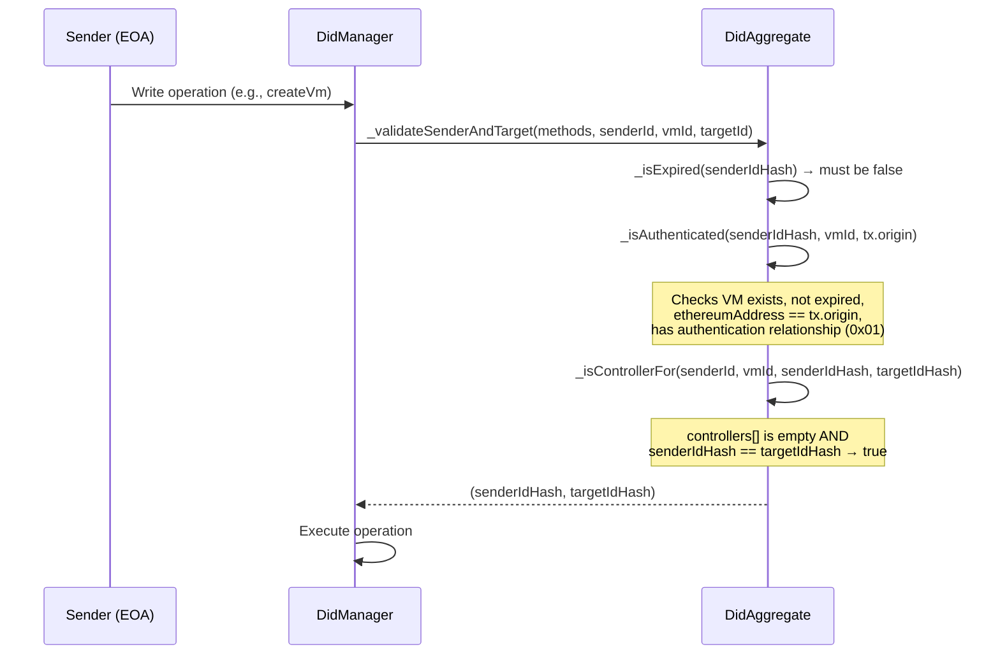
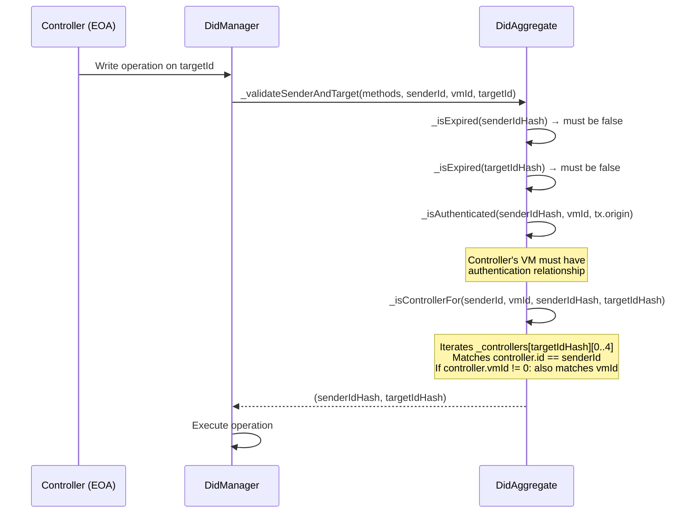
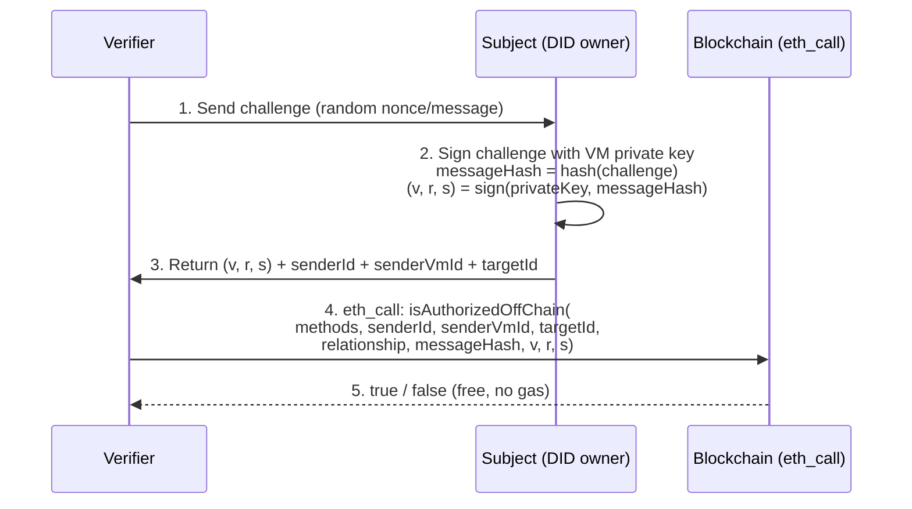
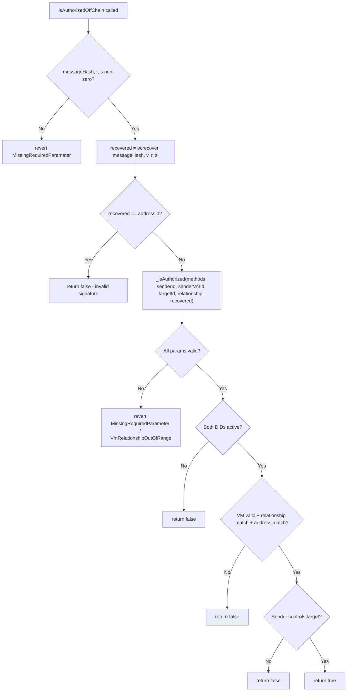
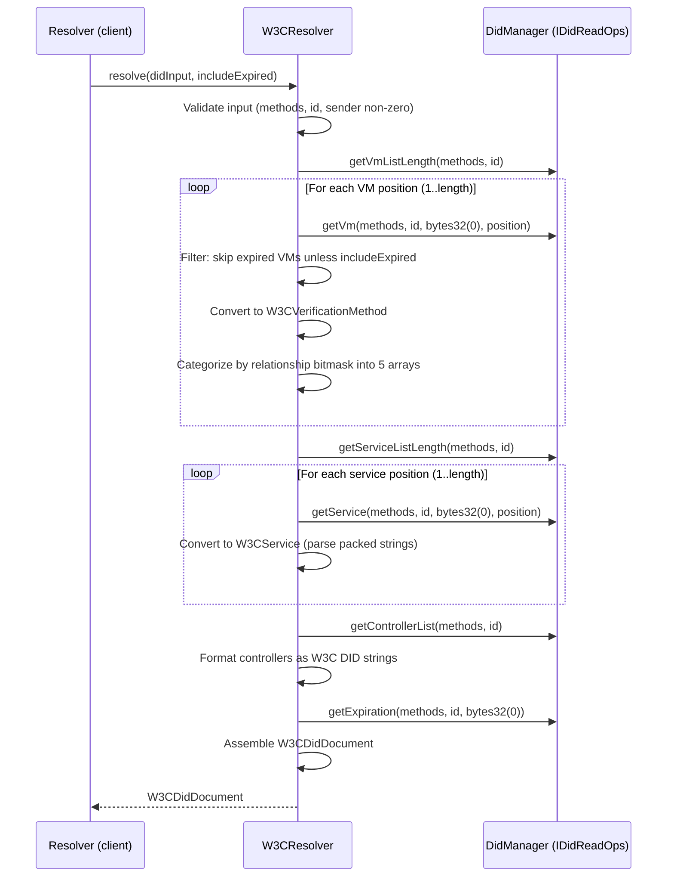
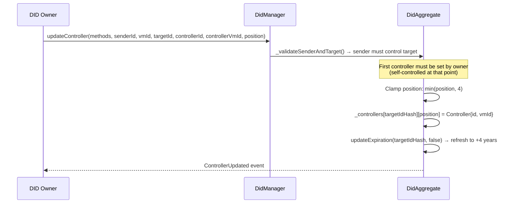
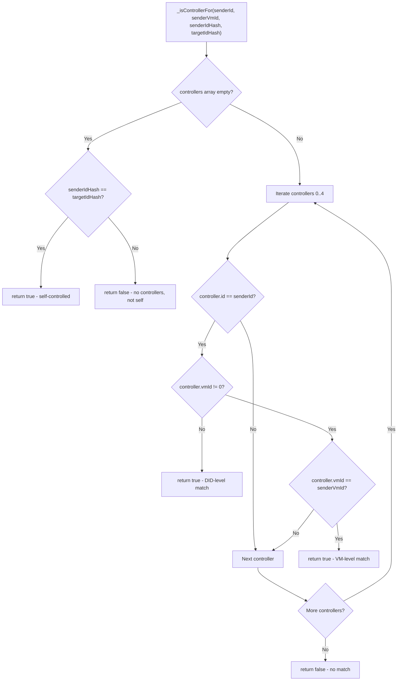

# DID Lifecycle Flows

**Version**: 1.0.0 | **Date**: 2026-03-10 | **Status**: Active
**Source contracts**: `src/DidAggregate.sol`, `src/DidManager.sol`, `src/DidManagerNative.sol`, `src/W3CResolverBase.sol`

## Table of Contents

- [1. Roles and Terminology](#1-roles-and-terminology)
- [2. On-Chain Authentication](#2-on-chain-authentication)
  - [2.1 Self-Controlled DID Authentication](#21-self-controlled-did-authentication)
  - [2.2 Controller-Delegated DID Authentication](#22-controller-delegated-did-authentication)
  - [2.3 Internal Auth Validation (_validateSenderAndTarget)](#23-internal-auth-validation-_validatesenderandtarget)
- [3. Off-Chain Authentication](#3-off-chain-authentication)
  - [3.1 Challenge-Response Pattern](#31-challenge-response-pattern)
  - [3.2 isAuthorizedOffChain Flow](#32-isauthorizedoffchain-flow)
  - [3.3 Self-Controlled vs Controller-Delegated](#33-self-controlled-vs-controller-delegated)
- [4. DID Resolution](#4-did-resolution)
  - [4.1 Full W3C Resolution](#41-full-w3c-resolution)
  - [4.2 Ethereum-Native Resolution](#42-ethereum-native-resolution)
  - [4.3 Service Endpoint Resolution](#43-service-endpoint-resolution)
- [5. Controller Delegation](#5-controller-delegation)
  - [5.1 Setting Controllers](#51-setting-controllers)
  - [5.2 Controller Authorization Chain](#52-controller-authorization-chain)
  - [5.3 Constraints and Edge Cases](#53-constraints-and-edge-cases)
- [6. Operations Reference](#6-operations-reference)
  - [6.1 DID Creation](#61-did-creation)
  - [6.2 Verification Method (VM) Add and Validate](#62-verification-method-vm-add-and-validate)
  - [6.3 Service Endpoint Management](#63-service-endpoint-management)
  - [6.4 DID Deactivation and Reactivation](#64-did-deactivation-and-reactivation)

---

## 1. Roles and Terminology

| Role | Description |
|------|-------------|
| **Subject** | Entity identified by the DID (may or may not control it) |
| **Owner** | EOA that created the DID (`tx.origin` at creation time); owns the initial VM |
| **Sender** | EOA executing the current transaction (`tx.origin` for on-chain, recovered address for off-chain) |
| **Controller** | DID authorized to act on behalf of another DID (up to 5 per DID) |
| **Verifier** | External party checking authorization (calls `isAuthorized` / `isAuthorizedOffChain` via `eth_call`) |
| **Resolver** | Entity querying `W3CResolver.resolve()` to obtain a W3C DID Document |

| Term | Description |
|------|-------------|
| **VM** | Verification Method — cryptographic key bound to a DID with W3C relationship(s) |
| **Relationship** | W3C bitmask: `0x01` authentication, `0x02` assertionMethod, `0x04` keyAgreement, `0x08` capabilityInvocation, `0x10` capabilityDelegation |
| **idHash** | `keccak256(methods, id)` — primary storage key for a DID |
| **positionHash** | `keccak256(idHash, position)` — used to locate VMs by index (for `validateVm`) |

---

## 2. On-Chain Authentication

On-chain authentication relies on `tx.origin` matching the `ethereumAddress` stored in a Verification Method. Two auth entry points exist:

- **`isAuthorized()`** — Non-reverting composite check (VM relationship + controller). Used by verifiers.
- **`isVmRelationship()`** — Reverting single-VM check. Used internally by authenticated operations.

### 2.1 Self-Controlled DID Authentication

When `senderId == targetId` and no controllers are set.

### 2.2 Controller-Delegated DID Authentication

When `senderId != targetId` and the sender's DID is registered as a controller.

### 2.3 Internal Auth Validation (_validateSenderAndTarget)

All authenticated write operations (`createVm`, `deactivateDid`, `updateController`, `updateService`, etc.) share the same validation via `_validateSenderAndTarget()`:

1. Calculate `senderIdHash` and `targetIdHash`
2. Check both DIDs are active (not expired/deactivated)
3. Check sender is authenticated (VM exists, not expired, `tx.origin` matches, has authentication relationship)
4. Check sender controls target (self-controlled or registered as controller)

On failure, reverts with: `DidExpired`, `NotAuthenticatedAsSenderId`, or `NotAControllerForTargetId`.

---

## 3. Off-Chain Authentication

Off-chain authentication enables **gasless DID ownership verification** via `eth_call`. Instead of relying on `tx.origin`, the signer proves ownership by providing an ECDSA signature over a challenge message.

### 3.1 Challenge-Response Pattern

**Key properties:**
- **Gasless**: `eth_call` costs nothing; the verifier doesn't submit a transaction
- **Atomic**: Signature recovery + authorization check in a single call
- **Signing-scheme agnostic**: The contract receives an opaque `messageHash`; callers choose EIP-191, EIP-712, or raw hashing
- **Non-reverting**: Returns `false` for auth failures (expired DID/VM, wrong signer, missing relationship)

### 3.2 isAuthorizedOffChain Flow

**Signature**: `isAuthorizedOffChain(bytes32 methods, bytes32 senderId, bytes32 senderVmId, bytes32 targetId, bytes1 relationship, bytes32 messageHash, uint8 v, bytes32 r, bytes32 s) → bool`

**Location**: `src/DidAggregate.sol`

### 3.3 Self-Controlled vs Controller-Delegated

Both modes work identically to on-chain authentication (Section 2), but the `sender` address comes from `ecrecover` instead of `tx.origin`:

| Aspect | Self-Controlled | Controller-Delegated |
|--------|----------------|---------------------|
| `senderId` | Same as `targetId` | Controller's DID ID |
| `senderVmId` | Subject's VM ID | Controller's VM ID |
| `targetId` | Subject's DID ID | Target DID ID |
| Signer | Subject's VM private key | Controller's VM private key |
| Controller check | Skipped (empty controllers + self) | Iterates controller slots |

---

## 4. DID Resolution

Resolution converts on-chain storage into a W3C DID Document. Two resolver variants exist for the two manager variants.

### 4.1 Full W3C Resolution

**Entry point**: `W3CResolver.resolve(W3CDidInput, includeExpired) → W3CDidDocument`

**W3C Document structure:**
- `@context`: `["https://www.w3.org/ns/did/v1"]`
- `id`: `"did:method0:method1:method2:0x{id}"`
- `controller`: Array of controller DID strings
- `verificationMethod`: Array of W3CVerificationMethod
- `authentication`, `assertionMethod`, `keyAgreement`, `capabilityInvocation`, `capabilityDelegation`: Arrays of VM ID references
- `service`: Array of W3CService
- `expiration`: DID expiration in milliseconds

### 4.2 Ethereum-Native Resolution

**Entry point**: `W3CResolverNative.resolve(W3CDidInput, includeExpired) → W3CDidDocument`

The Native resolver follows the same flow as Full W3C but uses **resolution-time derivation**: VM fields like `type_` and `blockchainAccountId` are derived from the stored `ethereumAddress` at query time, avoiding extra storage writes. The native VerificationMethod is a single storage slot (address + relationships + expiration), and the resolver constructs the full W3C-compliant fields on the fly.

### 4.3 Service Endpoint Resolution

**Entry point**: `W3CResolverBase.resolveService(W3CDidInput, serviceId) → W3CService`

Single-service lookup by `serviceId`:

1. Call `getService(methods, id, serviceId, 0)` (position=0 means lookup by ID)
2. Parse packed strings (type + endpoint stored as packed bytes)
3. Return `W3CService { id, type_, serviceEndpoint }`

---

## 5. Controller Delegation

Controllers enable one DID to act on behalf of another, supporting organizational hierarchies and key recovery scenarios.

### 5.1 Setting Controllers

**Important**: Once controllers are set, the original owner can no longer pass `_isControllerFor` (unless their DID is explicitly registered as a controller). This is by design — controller delegation transfers authority.

### 5.2 Controller Authorization Chain

### 5.3 Constraints and Edge Cases

| Constraint | Details |
|-----------|---------|
| **Max controllers** | 5 per DID (fixed-size array, positions 0-4) |
| **Position clamping** | If position > 4, clamped to 4 (last slot) |
| **VM restriction** | Optional: `controllerVmId = bytes32(0)` means any VM on the controller DID is accepted |
| **No circular prevention** | The contract does not prevent A → B → A circular delegation (by design: no on-chain traversal) |
| **Deactivated target** | Controllers cannot act on a deactivated DID (expiration == 0) except via `reactivateDid` |
| **Controller removal** | Set `controllerId = bytes32(0)` at a position to remove that controller |

---

## 6. Operations Reference

Brief descriptions of remaining DID operations. For full NatSpec documentation, see the source contracts.

### 6.1 DID Creation

**Function**: `DidManager.createDid(bytes32 methods, bytes32 random, bytes32 vmId)`

1. Validate `random != 0`; default methods to `"lzpf::main::"` if zero
2. Generate ID: `keccak256(methods, random, tx.origin, block.prevrandao)`
3. Check DID doesn't already exist
4. Create initial VM with `authentication` (0x01) relationship bound to `tx.origin`
5. Auto-validate the initial VM
6. Set DID expiration to `block.timestamp + 4 years`
7. Emit `DidCreated`, `VmCreated`, `VmValidated`

**Result**: A new DID with one authenticated VM, controlled by the creator.

### 6.2 Verification Method (VM) Add and Validate

**Add**: `DidManager.createVm(DidCreateVmCommand)` — Requires sender authentication + controller authorization on target DID. Creates an unvalidated VM (expiration = 0 if ethereumAddress is provided). Max 256 VMs per DID.

**Validate**: `DidManager.validateVm(bytes32 positionHash, uint256 expiration)` — Must be called by the VM's `ethereumAddress` (proves key ownership). Sets the VM's expiration timestamp. Can only be called once per VM.

### 6.3 Service Endpoint Management

**Function**: `DidAggregate.updateService(methods, senderId, senderVmId, targetId, serviceId, type_, endpoint)`

Requires sender authentication + controller authorization. Services store `type_` and `serviceEndpoint` as packed bytes. Use `serviceId = bytes32(0)` with a position to remove a service.

### 6.4 DID Deactivation and Reactivation

**Deactivate**: `DidAggregate.deactivateDid(methods, senderId, senderVmId, targetId)` — Sets expiration to 0. Requires standard auth. Deactivated DIDs cannot participate in any operations.

**Reactivate**: `DidAggregate.reactivateDid(methods, senderId, senderVmId, targetId)` — Restores expiration to `now + 4 years`. Two modes:
- **Self-reactivation** (`senderId == targetId`): Skips DID expiration check (it's deactivated). Validates `_isVmOwner` only.
- **Controller-reactivation** (`senderId != targetId`): Requires controller's DID to be active. Standard controller auth applies.

Only works if `expiration == 0` (deactivated). Naturally expired DIDs (expiration < now) cannot be reactivated.

---

*This document is the canonical reference for DID lifecycle flows. Downstream projects (e.g., SSIoBC-vclaim) should reference this document rather than re-documenting DID-level authentication and authorization patterns.*
